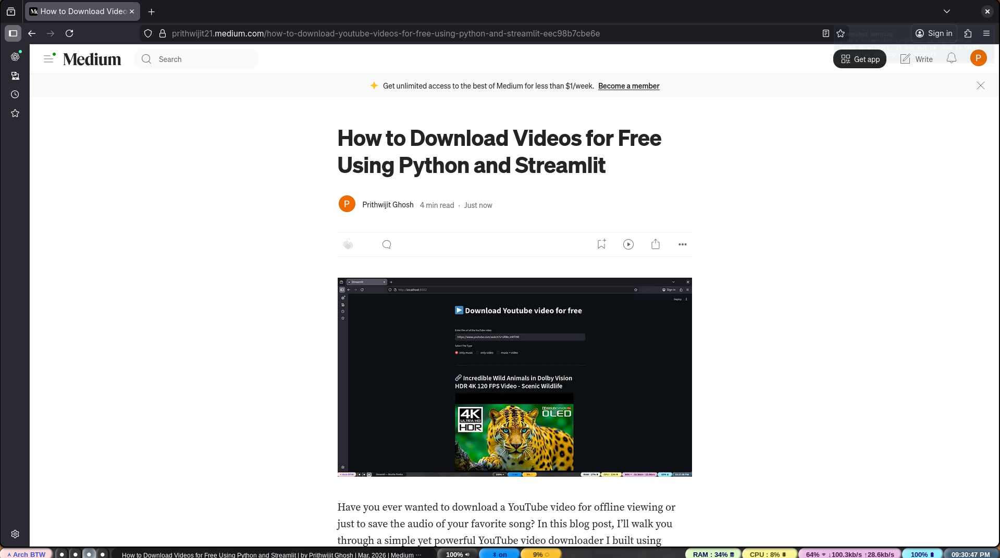

# ▶️ YouTube Video Downloader 🚀

This is a simple YouTube video downloader application built with Streamlit and `pytubefix`. It allows users to download YouTube videos as audio, video, or both, with options for different qualities.

If you are interested in the detailed process, coding logic or idea behind creating it, please go though the [****medium blog link****](https://prithwijit21.medium.com/how-to-download-youtube-videos-for-free-using-python-and-streamlit-eec98b7cbe6e?postPublishedType=initial)


## ✨ Features

-   🎵 Download YouTube videos as **audio only**.
-   🎥 Download YouTube videos as **video only**.
-   🎬 Download YouTube videos with **both audio and video**.
-   ⚙️ Option to select **low or high quality** for downloads.
-   🖥️ **User-friendly interface** built with Streamlit.

## 🛠️ Setup

### Prerequisites

-   🐍 **Python 3.8+**
-   🐳 **Docker** (optional, for running with Docker)

### Local Installation

1.  **Clone the repository:**
    ```bash
    git clone https://github.com/yourusername/youtube_video_downloader.git
    cd youtube_video_downloader
    ```
    (Note: Replace `https://github.com/yourusername/youtube_video_downloader.git` with the actual repository URL)

2.  **Create a virtual environment (recommended):**
    ```bash
    python -m venv venv
    source venv/bin/activate  # On Windows, use `venv\Scripts\activate`
    ```

3.  **Install dependencies:**
    ```bash
    pip install -r requirements.txt
    ```

## 🚀 Running the Application

### 1. ⬇️ Running a Pre-built Executable

:link: You can download a pre-built executable from the link:
[****YTDownloaderApp****](https://mega.nz/file/nyI1zSQZ#HqLVMo3MEgkLmdqOpdEWczhPbD5mmB0GZeJgcqCIy8U)

Once downloaded, run the executable based on your operating system:

-   **Windows:** Double-click the `.exe` file.
-   **Linux:** Navigate to the download directory in your terminal and run `./YTDownloaderApp`.
-   **macOS:** Navigate to the download directory in your terminal and run `./YTDownloaderApp`.

### 2. Running with Streamlit (Local Development)

To run the Streamlit application directly:

```bash
streamlit run app.py
```

This will open the application in your web browser.

### 2. 🐳 Running with Docker

You can also run the application using Docker.

1.  **Build the Docker image:**
    ```bash
    docker build -t yt-downloader .
    ```

2.  **Run the Docker container:**
    ```bash
    docker run -p 8501:8501 yt-downloader
    ```
    The application will be accessible in your web browser at `http://localhost:8501`.

### 3. Compose 🚀 Running with Docker Compose

If you have `docker-compose` installed, you can use the provided `docker-compose.yml` file:

```bash
docker-compose up --build
```
The application will be accessible in your web browser at `http://localhost:8501`.

### 4. 🖥️ Running the Desktop Application (Packaged Executable)

The project includes configurations for packaging the application into a standalone executable using PyInstaller.

1.  **Build the executable:**
    ```bash
    python -m PyInstaller YTDownloaderApp.spec
    ```
    or
    ```bash
    pyinstaller --add-data "app.py:." --collect-all streamlit --collect-all pytubefix --copy-metadata streamlit --name "YTDownloaderApp" --onefile -i youtube.ico run_app.py
    ```
    This will generate the executable in the `dist/` directory.

2.  **Run the executable:**
    ```bash
    ./dist/YTDownloaderApp
    ```
    (Note: The exact path and filename might vary slightly based on your OS and PyInstaller version.)

## 📦 Packaging

The desktop application is packaged using PyInstaller. The `YTDownloaderApp.spec` file defines the packaging configuration.

To recreate the executable, follow the steps in "Running the Desktop Application (Packaged Executable)" section.